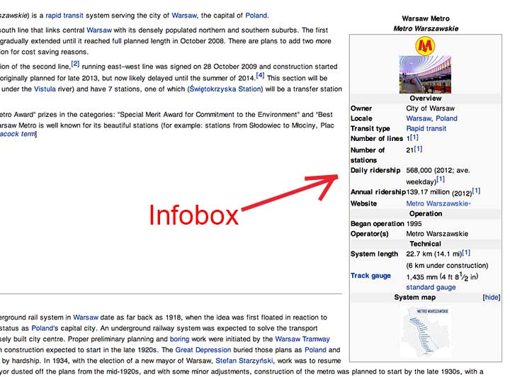

WikiInfobox by [@michalbe](http://github.com/michalbe)
=========

### What? ###
WikiInfobox is a simple Wikipedia infobox scraper. What is **infobox**? According to Wikipedia itself, _an infobox template is a panel, usually in the top right of an article, next to the lead section, (in the desktop view) or at the very top of an article (in mobile view), that summarizes key features of the page's subject. Infoboxes may also include an image, and/ or a map._



### Why? ###
* __Question:__ Why do we need WikiInfobox library? Wikipedia has it's own API!
* __Answer:__ Of course, but it answers only with full content of the current page, with all the Wiki-specific markdown code, without any formatting. It's really painful to get useful information out of this. Wiki-infobox parses Wikipedia API's response, and serve magnificent `JSON object`!


### How to use: ###
```
npm install wiki-infobox
```

then:
```javascript
var infobox = require('wiki-infobox');

var page = 'Warsaw Metro';
var language = 'en';

infobox(page, language, function(err, data){
  if (err) {
    // Oh no! Something goes wrong!
    return;
  }

  console.log(data);
  // {
  //   box_length: '275px',
  //   name: 'Warsaw Metro<br>\'\'Metro Warszawskie\'\'',
  //   owner: 'City of Warsaw',
  //   locale:
  //    [ { type: 'link',
  //        text: 'Warsaw',
  //        url: 'http://en.wikipedia.org/wiki/Warsaw' },
  //      { type: 'link',
  //        text: 'Poland',
  //        url: 'http://en.wikipedia.org/wiki/Poland' } ],
  //   transit_type:
  //    { type: 'link',
  //      text: 'Rapid transit',
  //      url: 'http://en.wikipedia.org/wiki/Rapid transit' },
  //   lines: '1<ref name',
  //   stations: '21<ref name',
  //   ridership: '568,000 <small>(2012; ave. weekday)</small><ref name',
  //   annual_ridership: '139.17 million <small>(2012)</small><ref name',
  //   website: '{{url|www.metro.waw.pl|Metro Warszawskie}}',
  //   began_operation: '1995',
  //   operator: 'Metro Warszawskie',
  //   marks: '',
  //   vehicles: '',
  //   system_length: '{{convert|22.7|km|mi|1|abbr',
  //   track_gauge:
  //    { type: 'link',
  //      text: 'standard gauge',
  //      url: 'http://en.wikipedia.org/wiki/standard gauge' },
  //   map:
  //    { type: 'image',
  //      text: 'frameless',
  //      url: 'http://en.wikipedia.org/wiki/File:Metro w Warszawie 1 linia.svg' },
  //   map_name: '',
  //   map_state: '}}'
  // }
});
```

### To Do ###
Support of:
* external links (like `{{url|www.metro.waw.pl|Metro Warszawskie}}`)
* templates (like `{{flag|Poland}}`)
* text & links or text & image in the same field
* comments
* somehow tidy HTML code inside fields
* expressions (like `{{ 3434 + 19817934 + 213123 }}`)
* maaany more


### Testing ###
If you are interested in contributing:

```bash
#clone the repo
$ git clone git@github.com:michalbe/wiki-infobox.git
$ cd wiki-infobot

#install all the dependencies
$ npm install

#to run jshint:
$ npm run lint

#to run tests
$ npm test
```

Tests & linter are hooked to commit (using [precommit-hook](https://github.com/nlf/precommit-hook)), so you cannot commit if linter is not passing or there are failing tests. If you need to do that anyway:
```bash
$ git commit -n
```
To mock the request connection I used [Nock](https://github.com/pgte/nock). Together with the templates & helpers prepared in `/tests/mocks/` it's possible to manipulate fake wikipedia API responses to fit requirements of the given test.
